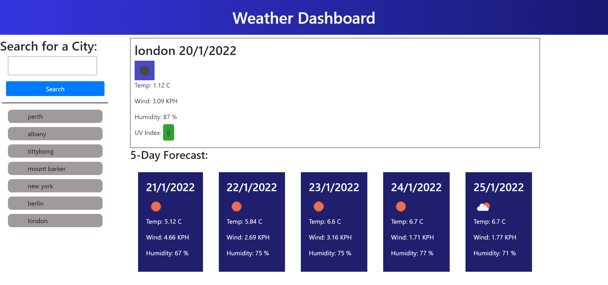

# weather_scheduler_TJ

## About

This projects was about creating a responsive weather viewing app, using 3rd party APIs

This webpage contains a header, a search bar and button with previous searches underneath, a main field to display the wanted information about the current day and 5 other boxes for the next days of the week

When you search a city, the information about the current day is displayed in the main section. The information about the rest of the week goes to the boxes underneath.

The UVI rating for that day is color coded based on severity.

Any recently searched cities will be shown under the search bar for easy repeat access.

While the data is being fetched, the city name changes to "loading", if an error occurs, it changes to "error, city not found" and a button will not be produced.

## Challenges Faced

When using the API to search for cities, i found that the main API didnt use city names as a filter, only latitude and longitide, but one of the other APIS did use the city name, but didnt return all the information I needed to display.

To fix this, I first put the searched name into the smaller API, and took its lat & long coordinates to use to search the more useful API for the information I need.

## The Final Product

live application available at [weather_scheduler_TJ](https://tomjia98.github.io/weather_scheduler_TJ/)

## Contact

for more information, feel free to contact me at Tomjia1998@gmail.com
